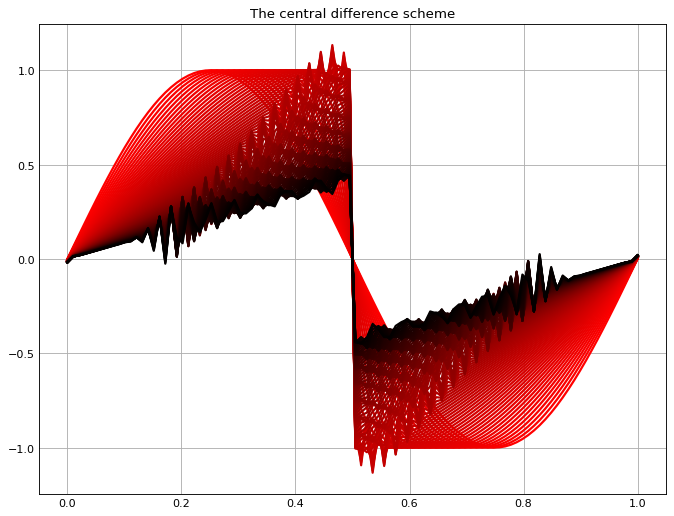
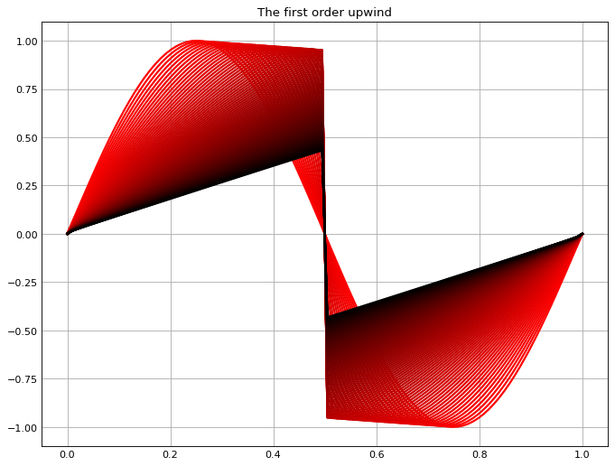
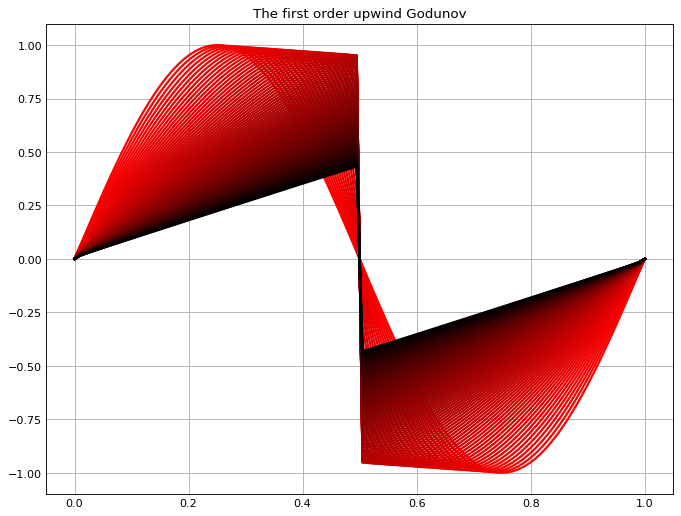
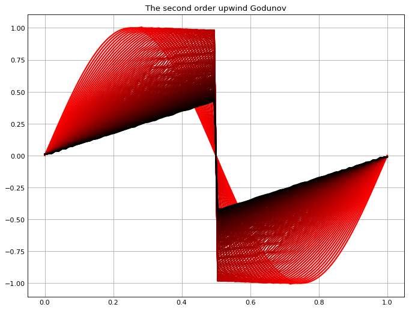

# Several numerical schemes for interpolation of the sinking term in the oceanic models"
## Liang Xu

# The list of the schemes implemented here

**1. The central difference scheme**;

**2. The first order upwind scheme**;

**3. The first order upwind Godunov scheme**;

**4. The second order upwind Godunov scheme**;

**5. The second order upwind Godunov scheme with Van Leer limitor**.

Schemes to be implemented:

1. The third order (quadratic) upwind scheme (QUICK);

2. The third order (quadratic) upwind Godunov scheme;

3. The piecewise parabolic methods (PPM) scheme;

etc.

# The physical model used as the example

The Burgers equation is used to demosntrate the performance difference in the schemes

$$
\frac{\partial u}{\partial t} +\frac{u}{2} \frac{\partial u}{\partial x} = 0
$$

where $u$ is the concentration of the tracer and the sinking rate is related to the concentration. 

The concentration along x axis is initialized as a since shape. As such, at the middle place, there is a shock wave generated due to the rightward moving wave colliding with the leftward moving wave. The performance of schemes differ significantly right here due to large curve gradients that ruin the smootheness of the curve.

# The central difference scheme

The osillations are generated due to low accuracy of the scheme at the shock wave. 

# The first order upwind scheme

The oscillations have been improved but artificial dissipation has been generated by this scheme. 

# The first order upwind Godunov scheme;

With Godunov scheme, it performs similarly to the first order upwind scheme.

# The second order upwind Godunov scheme

Using second order improves the dissipation. 

However, some slight oscillations are generated. So, we should go for a higher order scheme + Godunov. 

The second order upwind Godunov scheme with Van Leer limitor

This scheme with the Van Leer limitor has largely improved the dissipation and removed the oscillations.

A higher order scheme + Godunov + limitor should improve further.